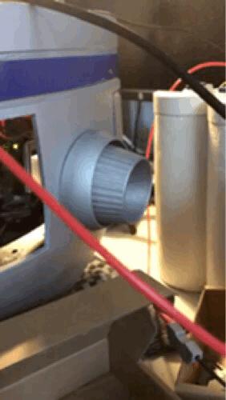

# HeadUno

This folder contains all firmware and helper classes used to drive **17 SG90 mini‑servos** in the R2‑D2 head:  
* 11 one‑axis **dome lids** and *3* two‑axis "**nobs**" (pan/tilt).  
An **Arduino Uno** talks to two **PCA9685 16‑channel I²C PWM servo drivers** to generate stable 50 Hz pulses.

---

## Table of Contents

1. [Hardware Overview](#hardware-overview)  
2. [Wiring Diagram](#wiring-diagram)  
3. [Software Structure](#software-structure)  
   - [HeadUno.ino](#headunoino)  
   - [SerialProcessor](#serialprocessor)  
   - [Lid](#lid)  
   - [Nob](#nob)  
4. [Usage](#usage)  
5. [Dependencies](#dependencies)  

---

## Hardware Overview

- **Microcontroller**: Arduino Uno (ATmega328P @ 16 MHz)  
- **Servo Drivers**: Two Adafruit PCA9685 16‑ch boards on I²C (addresses 0x40 & 0x41)  
- **Servos**: 17 × TowerPro SG90 mini‑servos  
- **Power**: Dedicated 5 V / ≥ 3 A rail for all servos (share GND with Uno)  
- **Serial**: USB‑Serial (57600 baud) with custom packet format (SOF 0xAA, LEN, …, CRC)

| | |
|---|---|
|  |  |

---

## Wiring Diagram

```
Arduino Uno        →  PCA9685 #1         PCA9685 #2
────────────────────────────────────────────────────────
A4  (SDA)  ───────► SDA                  SDA
A5  (SCL)  ───────► SCL                  SCL
5 V         ───────► VCC (logic 5 V)     VCC (logic 5 V)
GND         ───────► GND                 GND
                              A0 jumper → HIGH  (addr 0x41)
```

*Wire servo **V+** pins directly to the 5 V power rail – **not** to the Uno’s 5 V pin.*  
Tie all **GNDs** together.

---

## Software Structure

### HeadUno.ino

- **Purpose**: Entry point for the Uno.  
- **What it does**:  
  1. Calls `Wire.begin()` and sets I²C to 400 kHz (fast‑mode).  
  2. Instantiates two `Adafruit_PWMServoDriver` objects (`pwm0 @ 0x40`, `pwm1 @ 0x41`) and sets both to 50 Hz.  
  3. Creates the global `SerialProcessor sp;` with pointers to those drivers.  
  4. Inside `loop()` it simply calls `sp.listen()` to process incoming packets.

### SerialProcessor

- **Files**: `SerialProcessor.h`, `SerialProcessor.cpp`  
- **Key jobs**:  
  1. Wait for start‑of‑frame `0xAA`.  
  2. Read length byte, payload, and CRC; verify checksum.  
  3. Decode **CID** (class ID) and dispatch to either a `Lid` or `Nob` instance.  
  4. On error, echo one‑byte error code; otherwise execute command.  
  5. Stores the last valid packet and replays it if no new data arrive (keeps motions smooth).

### Lid

- **Files**: `Lid.h`, `Lid.cpp`  
- A thin wrapper around a *single* PCA9685 channel.  
- Public API: `openLid()`, `closeLid()`, `setOpenPos(deg)`, `setClosePos(deg)`, `getPositions()`.

### Nob

- **Files**: `Nob.h`, `Nob.cpp`  
- Controls a pan/tilt pair (two channels).  
- Methods: `setPos(dx,dy)`, `setPosX()`, `setPosY()`, `getPos()`, `runCircle()`.  
- Enforces a ±15° radius around its neutral position to avoid edges.


---

## Usage

1. **Compile & Upload**  
   - Open `HeadUno.ino` in the Arduino IDE ≥ 1.8.13.  
   - Install the **Adafruit PWM Servo Driver** library (Library Manager → search “PCA9685”).  
   - Select **“Arduino Uno”** as board, choose the USB port, click **Upload**.

2. **Sending Commands via Serial**  
   Use the Arduino Serial Monitor (115200 baud, *no* line ending) or a Python script.

   *Example – open Lid #1 (CID 0x01)*  
   ```txt
   [0xAA] [0x03] [0x01] [0x01] [CRC]
   CRC = 0xAA ^ 0x03 ^ 0x01 ^ 0x01 = 0xA9
   ```

   *Example – move Nob #2 to dx = ‑10°, dy = +5°*  
   ```
   SOF  LEN  CID  FID  dxLo dxHi  dyLo dyHi  CRC
   0xAA 0x07 0x11 0x01 0xF6 0xFF  0x05 0x00  CRC
                ^nob2 setPos
   CRC = XOR of all previous bytes = 0x1A
   ```

3. **Stop a long motion**  
   Any valid packet (even a “noop”) interrupts an ongoing `runCircle()` loop.

---

## Dependencies

- **Arduino IDE** ≥ 1.8.13  
- **Adafruit_PWMServoDriver** library by Adafruit  
- **Wire.h** (built‑in)  

---


