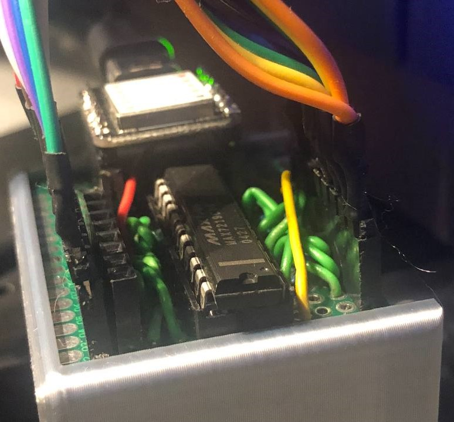
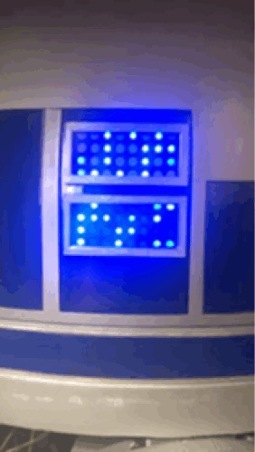

# HeadXiao8x8

This folder contains all code and configuration needed to drive two 4×8 LED matrix modules (using MAX7219 drivers) at the front of the R2D2 head. A Seeeduino XIAO acts as the microcontroller, communicating over the serial interface to control patterns, individual LEDs, or turn the display on/off.

---

## Table of Contents

1. [Hardware Overview](#hardware-overview)  
2. [Wiring Diagram](#wiring-diagram)  
3. [Software Structure](#software-structure)  
   - [HeadXiao8x8.ino](#headxiao8x8ino)  
   - [SerialProcessor](#serialprocessor)  
   - [FunctionProcessor](#functionprocessor)  
   - [Max7219 Wrapper](#max7219-wrapper)  
4. [Usage](#usage)  
5. [Dependencies](#dependencies)   

---

## Hardware Overview

- **Microcontroller**: [Seeeduino XIAO](https://www.seeedstudio.com/Seeeduino-XIAO-p-4759.html)  
- **LED Drivers**: Two 4×8 LED matrices via interface of a single MAX7219 chip.  
- **Power**: 5 V from the Xiao's USB-C port.  
- **Serial Communication**: USB-Serial on the XIAO, accepts custom packets (SOF + length + payload + CRC).

|  |  |
|------------|-----------|
|  |  |


---

## Wiring Diagram

Below is the pin mapping between the Seeeduino XIAO and the MAX7219 module. 

```
Seeeduino XIAO        →  MAX7219 Module (first chip)
────────────────────────────────────────────────────
     D10 (pin “10”)   →  DIN  (data in)
      D8  (pin “8”)   →  CLK  (clock)
      D7  (pin “7”)   →  CS   (chip select)
      GND             →  GND
      5 V             →  VCC (5 V)
```
---

## Software Structure

### HeadXiao8x8.ino

- **Purpose**: Entry point for the XIAO.  
- **What it does**:
  1. Initializes `Serial.begin(115200)` (or your chosen baud rate).  
  2. Constructs an instance of `SerialProcessor`.  
  3. In `loop()`, repeatedly calls `SerialProcessor.listen()`, which:
     - Reads one packet (SOF = `0xAA`, length byte, payload bytes, CRC).  
     - On CRC failure or no new packet, replays the last valid packet to maintain a persistent display state.  
     - Dispatches the payload to the `FunctionProcessor`, which executes actual LED commands.

> **Note**: The packet format is:
> ```plain
> [0]   = 0xAA (start-of-frame)
> [1]   = len (total bytes: classID + funcID + N payload bytes + CRC)
> [2]   = classID (0x01 for “matrix control”)
> [3]   = funcID  (0x01…0x05, see below)
> […  ] = payload (variable length, depending on funcID)
> [last] = CRC  (SOF ^ len ^ all bytes from index 2 to index len–1)
> ```
### SerialProcessor

- **Files**:  
  - `SerialProcessor.h`  
  - `SerialProcessor.cpp`  

- **Key Responsibilities**:
  1. **Framing**: Waits for a `0xAA` byte on Serial (SOF).  
  2. **Length Check**: Reads the next byte `len`; if `len < 3` or `len > MAX_PKT (32)`, it treats it as invalid.  
  3. **Packet Read**: Reads exactly `len` bytes into a local buffer.  
  4. **CRC Check**: Computes `crc = SOF ^ len ^ (all payload bytes up to crc)`. If CRC is bad, sends error code `0x01` back over Serial and replays last good packet.  
  5. **Dispatch**: On valid packet, calls `FunctionProcessor::processPacket()`, passing the raw `uint8_t* packet` and its `len`.  
  6. **Fallback**: If no new packet arrives (`Serial.available()` is zero), simply replays `lastPkt` to maintain current pattern.

- **Important Constants** (in `SerialProcessor.h`):
  ```cpp
  static constexpr uint8_t SOF     = 0xAA;
  static constexpr uint8_t MAX_PKT = 32;
  ```

### FunctionProcessor

- **Files**:  
  - `FunctionProcessor.h`  
  - `FunctionProcessor.cpp`  

- **Class**: `FunctionProcessor`  
  - Holds a private `Max7219 matrix;` instance.  
  - **`processPacket(uint8_t *packet, uint8_t len)`**:
    1. Extracts `classID = packet[0]`, `funcID = packet[1]`, `payloadLen = len – 3`.  
    2. If `classID == 0x01`, routes commands to `matrix`. Otherwise returns error `0x02` (invalid class).  
    3. Based on `funcID`, performs one of the following (all return `0x00` on success):
       - **`funcID == 0x01` (randomLights)**  
         - Payload (optional): `[rateOn, rateChange, dt]`  
         - Defaults: `rateOn = 35`, `rateChange = 10`, `dt = 150 (ms)`  
         - Calls `matrix.randomLights(rateOn, rateChange, dt)`.  
       - **`funcID == 0x02` (displayOn)**:  
         - No payload. Calls `matrix.displayOn()`.  
       - **`funcID == 0x03` (displayOff)**:  
         - No payload. Calls `matrix.displayOff()`.  
       - **`funcID == 0x04` (set full frame)**:  
         - Expects exactly 8 payload bytes. Each byte represents one 8-bit row.  
         - Builds a local `bool frame[8][8]` by testing each bit of each byte.  
         - Calls `matrix.setLeds(frame)`.  
         - Returns error `0x04` if `payloadLen < 8`.  
        - **`funcID == 0x05` (set single LED)**:  
          - Payload: `[row (0–7), col (0–7), ledState (0 or 1)]`  
          - Calls `matrix.setSingleLed(row, col, ledState)`.  
          - Returns error `0x04` if payload length ≠ 3.  
        - **Other `funcID`**: returns error `0x03` (invalid function ID).

> **Error Codes** (returned over Serial, one-byte):
> - `0x00` → success  
> - `0x01` → CRC failed  
> - `0x02` → invalid classID  
> - `0x03` → invalid funcID  
> - `0x04` → bad payload length

### Max7219 Wrapper

- **Files**:  
  - `Max7219.h`  
  - `Max7219.cpp`  

- **Class**: `Max7219`  
  - **Members**:  
    - `bool leds[8][8]` — local 8×8 buffer for LED states.  
    - SPI pins:  
      ```cpp
      int DIN, CLK, CS;
      LedControl lc; // from <LedControl.h>
      ```
  - **Constructor**:  
    - Initializes pins (`DIN=10`, `CLK=8`, `CS=7`) and instantiates `lc(DIN, CLK, CS, 0)`, where the last parameter `0` means “one device in chain.”  
    - Leaves `leds[][]` uninitialized (but code always sets them before use).  
  - **Methods**:
    1. **`void displayOff()`**  
       - Calls `lc.clearDisplay(0)`, which sets all LEDs off.  
    2. **`void randomLights(uint8_t ratOn, uint8_t ratChange, uint8_t dt)`**  
       - Fills `leds[][]` with a random pattern where each LED is “on” with probability `ratOn%`.  
       - Enters a loop:  
         - While no new Serial data arrives, flip (toggle) each LED with probability `ratChange%` each iteration.  
         - Push the entire `leds[][]` array to the physical module using `lc.setLed(0, row, col, leds[row][col])`.  
         - `delay(dt)` milliseconds per iteration.  
       - As soon as `Serial.available() > 0`, the function returns to allow next command.  
    3. **`void displayOn()`**  
       - Sets every entry in `leds[][] = true` and pushes to the matrix via `lc.setLed(...)`.  
    4. **`void setLeds(const bool (&newLeds)[8][8])`**  
       - Copies an 8×8 bool array into `leds[][]`, then updates every LED via `lc.setLed(...)`.  
    5. **`void setSingleLed(uint8_t row, uint8_t col, bool led)`**  
       - Updates `leds[row][col]` and immediately calls `lc.setLed(0, row, col, led)`.

## Usage

1. **Compile & Upload**  
   - Open `HeadXiao8x8.ino` in the Arduino IDE (≥ 1.8.13).  
   - Install the [LedControl](https://github.com/wayoda/LedControl) library (via Library Manager).  
   - Select “Seeeduino XIAO” as the board, choose the correct USB port, and click **Upload**.

2. **Sending Commands via Serial**  
   - Use any serial-terminal (e.g., the Arduino Serial Monitor at 115200 baud) or a custom Python script.  
   - **Example**: Turn on all LEDs → send packet  
     ```txt
     [0xAA] [0x03] [0x01] [0x02] [CRC]
     ```  
     - `0xAA` = SOF  
     - `0x03` = length (classID + funcID + CRC = 3 bytes)  
     - `0x01` = classID (matrix control)  
     - `0x02` = funcID (`displayOn()`)  
     - `CRC = 0xAA ^ 0x03 ^ 0x01 ^ 0x02`

   - **Example**: Set a single LED at row 2, col 5 to ON → send  
     ```txt
     [0xAA] [0x05] [0x01] [0x05] [0x02] [0x02] [CRC]
     ```  
     - `0x01` = classID  
     - `0x05` = funcID (`setSingleLed`)  
     - Payload: `[row=2] [col=5] [led=1]`  
     - CRC = `0xAA ^ 0x05 ^ 0x01 ^ 0x05 ^ 0x02 ^ 0x02`

   - **Example**: Display a custom 8×8 frame:  
     - Suppose the 8 bytes (one per row) are `[0xFF, 0x81, 0x81, 0x81, 0x81, 0x81, 0x81, 0xFF]` (outline box).  
     - Total packet length = 1 (class) + 1 (func) + 8 (payload) + 1 (CRC) = 11 → length byte is `0x0B`.  
     - Full packet:  
       ```
       0xAA  0x0B  0x01  0x04  0xFF  0x81  0x81  0x81  0x81  0x81  0x81  0xFF  CRC
       ```

3. **Stopping a `randomLights` Loop**  
   - The `randomLights` routine checks `while (!Serial.available())`, so sending any valid command (even a “no-op” that the firmware doesn’t recognize) breaks the loop and returns control to the main packet handler.

---

## Dependencies

- **Arduino IDE** ≥ 1.8.13 (for compiler support and Seeeduino XIAO definitions)  
- **LedControl Library** by Eberhard Fahle (for MAX7219 interface)  
  Install via **Sketch → Include Library → Manage Libraries…**, search “LedControl” and install.  
- **Seeeduino XIAO Drivers** (For more information see [seeedstudio.com/Seeeduino-XIAO](https://wiki.seeedstudio.com/Seeeduino-XIAO/)).
