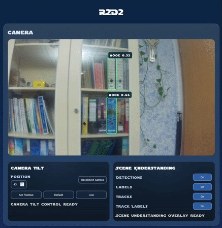
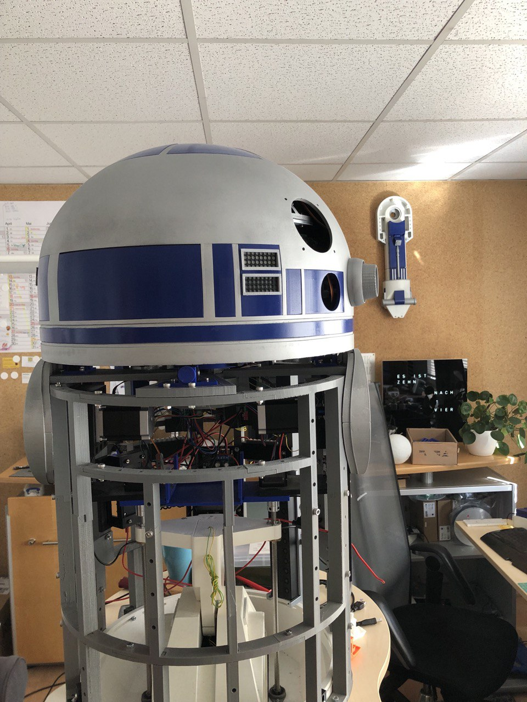
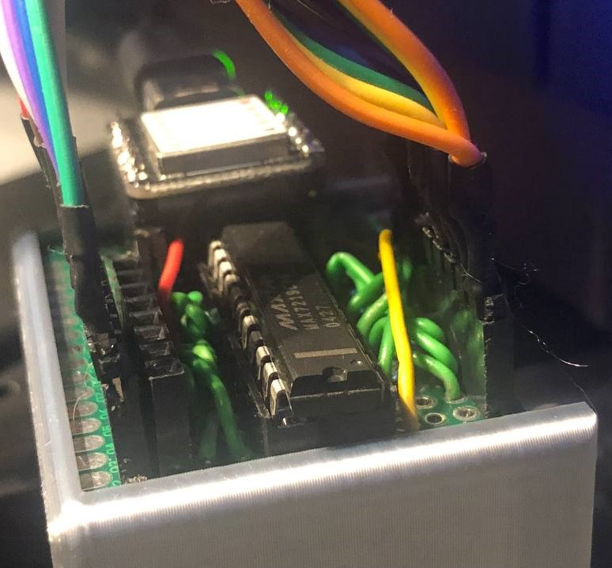

# R2-D2 Astromech Robot

Custom built R2-D2 with distributed electronics, real-time vision and a ROS2 based control system.

<table>
  <tr>
    <td width="38%" align="center" valign="top">
      
      <br>
      <sub>Head movement and dome mechanics</sub>
    </td>
    <td width="62%" align="center" valign="top">
      
      <br>
      <sub>Live tracking and browser-based control interface</sub>
    </td>
  </tr>
</table>

---

## Overview

This repository contains the software and firmware for a full-scale R2-D2 build.

The robot is organized as a collection of independent devices distributed across the body.  
Each device runs its own firmware or ROS nodes and communicates with the rest of the system over a dedicated robot network.

A Jetson acts as the central system for perception, control and user interaction.

---

## Build Progress

<div align="center">
  
</div>

The project combines mechanical construction, embedded electronics and GPU-accelerated computer vision in one system.

---

## What is in the Repository

The repository mirrors the physical structure of the robot.

Top-level folders correspond to body parts:

```text
Body/
Head/
LeftLeg/
RightLeg/
````

Inside each body part folder, the layout follows the same idea:

```text
BodyPart/
    Device/
        Firmware or ROS workspace
```

Examples:

```text
Body/BodyJetson/
Head/HeadRaspberry/
LeftLeg/LeftLegEsp32c3/
RightLeg/RightLegEsp32c3/
```

This keeps the software aligned with the physical system and makes the project easier to navigate.

---

## System Focus

The Jetson hosts the main ROS2 environment and runs the high-level parts of the robot:

* perception and tracking
* communication bridges
* web interface
* system coordination

The microcontrollers and embedded boards handle the hardware that lives in the individual body parts and must be flashed with their respective firmware.

Detailed setup instructions are located in the README files inside the corresponding folders.

---

## Selected Subsystems

<table>
  <tr>
    <td width="52%" valign="middle">
      <h3>Vision and Control Interface</h3>
      <p>
        The Jetson runs a perception pipeline that processes the camera stream in real time and forwards the results to a browser-based control interface.
        This makes vision and robot control visible in one place and gives the project an immediate systems view.
      </p>
    </td>
    <td width="48%" align="center" valign="middle">
      
    </td>
  </tr>
</table>

<table>
  <tr>
    <td width="42%" align="center" valign="middle">
      
    </td>
    <td width="58%" valign="middle">
      <h3>Head Mechanics</h3>
      <p>
        The dome contains multiple moving elements and custom electronics.
        This part of the project combines printed parts, actuators and embedded control into one of the most visually distinctive subsystems.
      </p>
    </td>
  </tr>
</table>

<table>
  <tr>
    <td width="58%" valign="middle">
      <h3>Custom Electronics</h3>
      <p>
        Alongside the ROS-based software stack, the project includes several smaller embedded systems for lighting, actuation and device-level control.
        These modules are developed as dedicated hardware units inside the corresponding body-part folders.
      </p>
    </td>
    <td width="42%" align="center" valign="middle">
      
    </td>
  </tr>
</table>

---

## Running the Main System

After cloning the repository, the Jetson-side services can be started with Docker:

```bash
docker compose up
```

This brings up the main high-level services such as the communication layer, perception stack and web interface.

The embedded boards are flashed separately and documented in their own folders.

---

## Project Status

This is an active long-term build.

The repository is intended to document the architecture and development of the robot while keeping the system modular as new capabilities are added.

