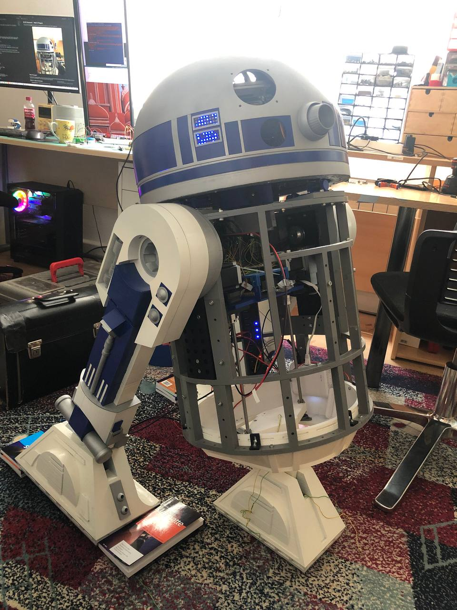

---

# R2-D2 Astromech — Work in Progress

> Building a fully functional **R2-D2**: custom electronics in each body part, ROS 2 across devices, and a Jetson “brain” coordinating it all.

<div align="center">

<!-- Replace these placeholders with real photos when ready -->



</div>

## What’s this project?

A personal build of an **R2-D2 astromech** you can drive and extend: legs with IMUs and stepper control, a ROS 2 head with camera and LEDs, and a Jetson coordinating everything over a private LAN. It’s an evolving project — expect frequent changes and new parts coming online.

## Devices at a glance (current plan)

* **Head (Raspberry Pi 5)** — runs ROS 2 for camera and head features; talks to:

  * **Arduino Uno** (eye/lid mechanics),
  * **2× Seeeduino XIAO** (LED matrices).
  * Head ↔ Body link is **wireless** (WLAN) so the head can rotate freely; power goes through a **slip ring**.

* **Legs (Seeed XIAO ESP32-C3)** — one in each leg, streaming **MPU-6500** IMUs (tibia & foot), reading buttons, and driving a stepper. (Left/right use the same firmware with different IP/port.)

* **Main brain (Jetson Orin Nano)** — runs **ROS 2** and bridges to all devices over TCP; republishes sensors and exposes commands.

* **Motor control (Raspberry Pi Pico RP2040)** — will receive **high-level** commands from the Jetson and handle low-level motor control.

> 3D parts: **.stl files** aren’t published yet — happy to share on request.

## Repository layout

Folders follow this convention:

```
/<BodyPart>/<Device>/<Code or Project>
```

* **Body parts:** `Head/`, `Body/`, `LeftLeg/`, `RightLeg/`
* **Device:** what’s embedded there (e.g., `ESP32C3`, `BodyJetson`)
* **Code/Project:** the firmware or ROS 2 workspace for that device

Examples you’ll see in the repo:

* `Body/BodyJetson/central_comm/…` — Jetson ROS 2 workspace (messages + bridge)
* `LeftLeg/LeftLegEsp32c3/` — ESP32-C3 firmware for the left leg
* `RightLeg/RightLegEsp32c3/` — same firmware, different IP/port
* `Head/` — head-related code and assets
* `Tests/` — small utilities and experiments ([GitHub][1])

## Quick start (high level)

1. **Flash a leg** (ESP32-C3) with the leg firmware; set the static IP/port.
2. **Start the Jetson bridge** (ROS 2) to connect to that leg and publish IMU topics.
3. **Add the head** (Raspberry Pi 5) on WLAN and bring its ROS 2 nodes online.
4. **Iterate**: more devices, more behaviors, more polish.

(Each subfolder has its own `README.md` with the exact steps.)

## Status

This is **actively under construction**. The goal for now is a tidy structure, consistent device-side firmware, and a minimal ROS 2 pipeline. Expect frequent updates as mechanics, wiring, and software mature.

## Gallery (placeholders)

* Assembly shots
  ``

* Electronics bay
  ``

* First motion / field test
  ``

## Contact & contributing

Ideas, feedback, or curiosity about parts/prints? Open an issue or reach out — especially if you’re interested in the .stl files or specific submodules.

---

*Thanks for stopping by — more photos and progress soon!*

[1]: https://github.com/xamweil/R2D2 "GitHub - xamweil/R2D2"
